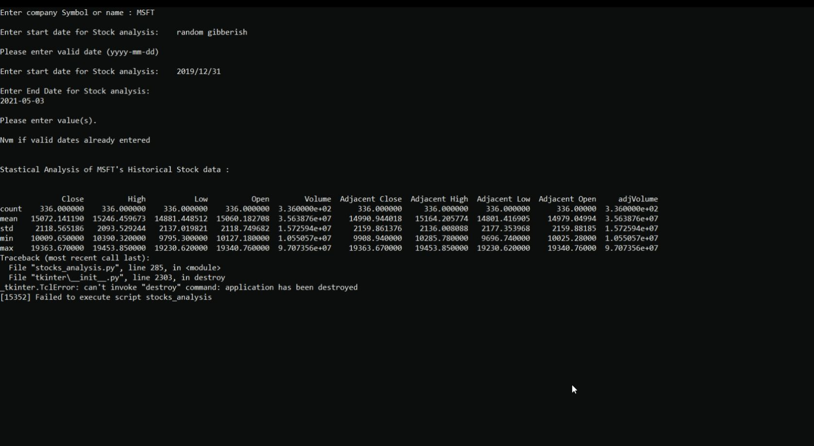
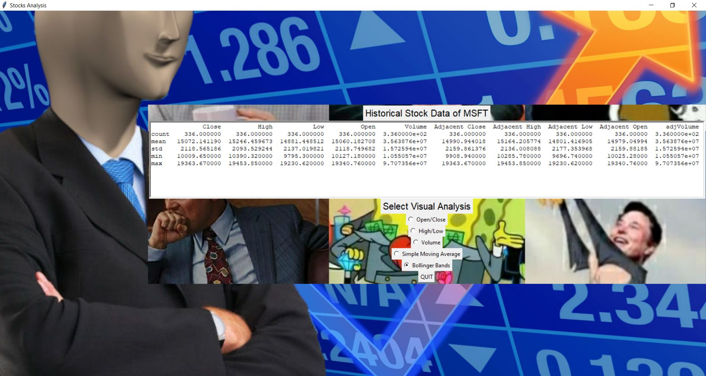
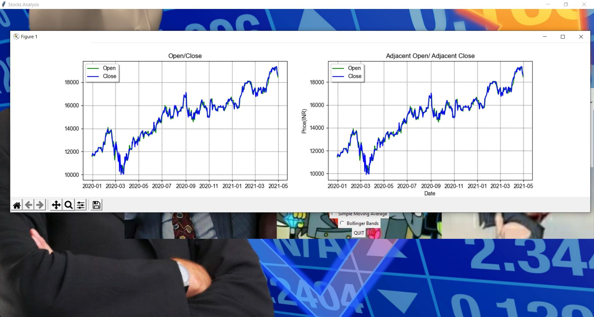
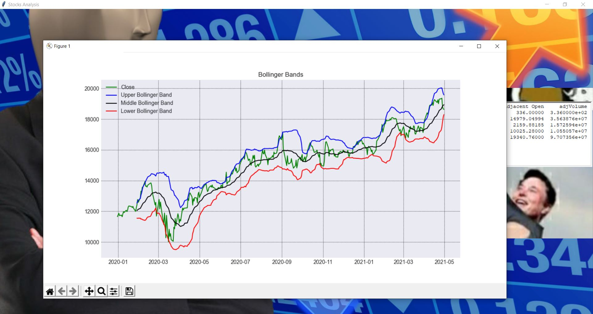

# Stocks Analysis

 
 This GUI application prompts for Stock Ticker and range of dates and analyzes and visualizes Historical Stock Data of said ticker.
 This Project was made using Python and it's libraries including but not limited to Pandas, Matplotlib and Tkinter.
 
 
 # INSTRUCTION
 
 To run this file,dowload [exe](https://github.com/vibhu-exe/Stocks-Analysis) in your pc :computer:
 and install it on your local device
 
 # Thank You For Downloading The Project :smile:
 
 # :hearts:
 
 # SCREENSHOTS

1.)Home Page
 
 
 1.1)Home Page (alternate inputs)
 
 
2.)Analysis
 

3.)Visualization
 
 
 
